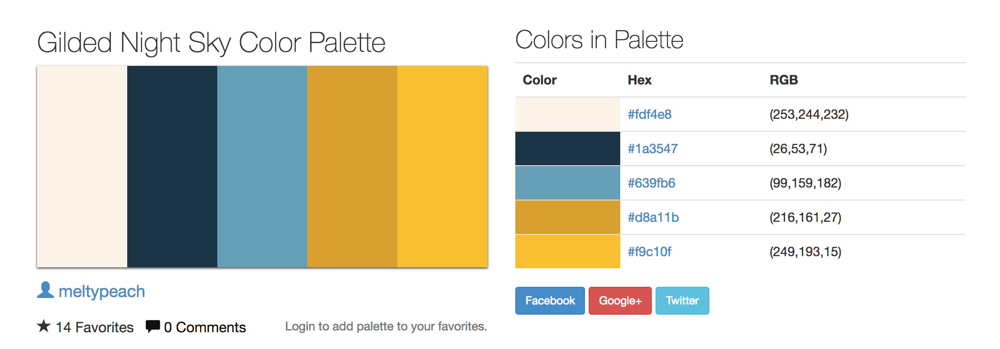

# ProjectOne

Flight Reservation Points System

#

### Members

 - Richard Dip([@richarddip28](https://github.com/richarddip28))
 - Adrien Yong
 - Brandon Lo
 - Kogul Bala
 - Darren Prong([@DarrenProng](https://github.com/DarrenProng))
 - Eric Zalameda([@ericzlmd](https://github.com/ericzlmd))

#

### Development Branch Sequence  
  
  **dev** - Development branch. All production code that will be produced/used/implemented are going to be on this branch.    

  **test** - Testing branch. Form validation, entry and exit point checking, javascript functions, spellcheck, grammar, styling, etc. are all going to be tested on this branch, and will determine release candidates. **NO CODE SHALL PASS FROM TEST->MASTER WITHOUT THOROUGH TESTING.**
    
  **master** - Passed release candidate. Merged from `test` branch to `master`. Fully functioning, production code. :)  

`DEV -> TEST -> MASTER`  
    
##### Check Current Working Branch  
`git branch`  
  
##### Switching Between Branches  
`git checkout [branch name]`  

##### Pushing Local Branch Update to Remote    
`git push origin [branch name]`  

##### Fetching Updates from Remote  
`git fetch [branch name]`

#  